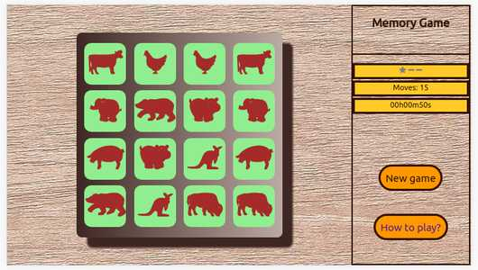
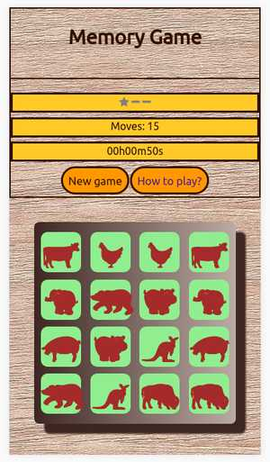
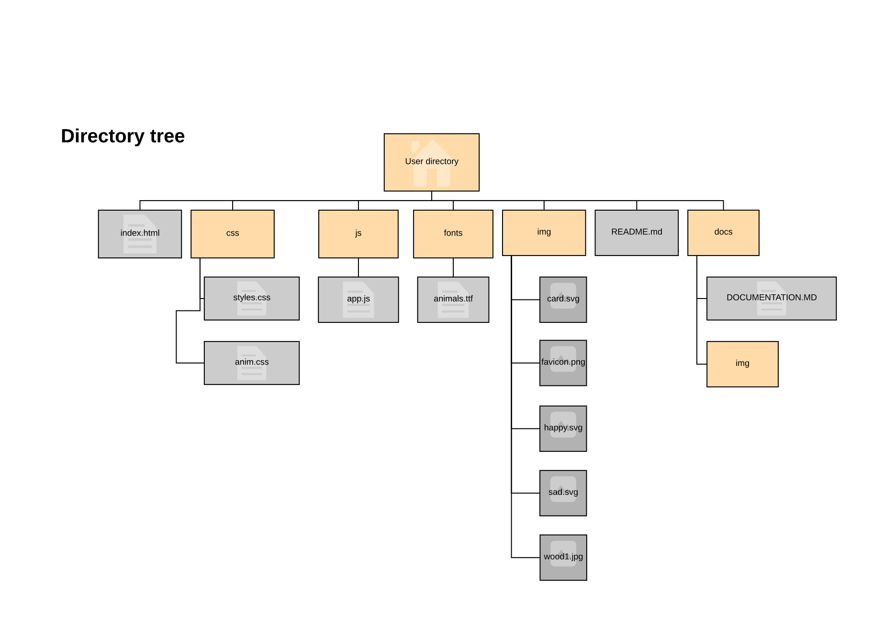
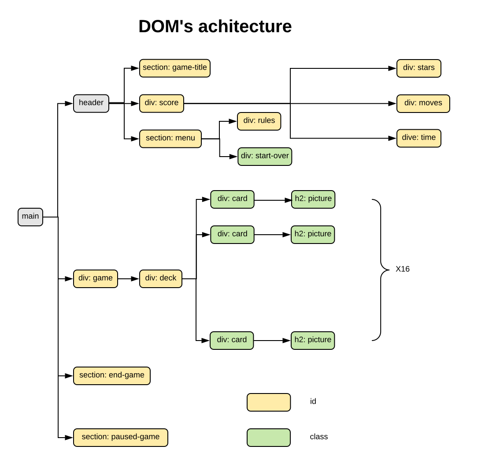
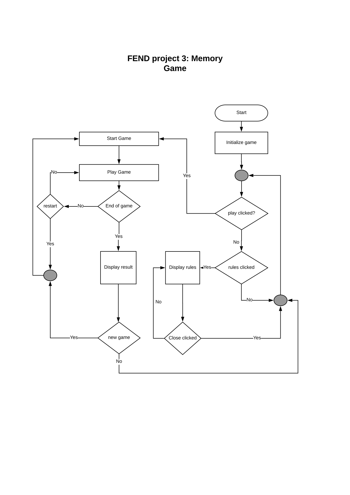
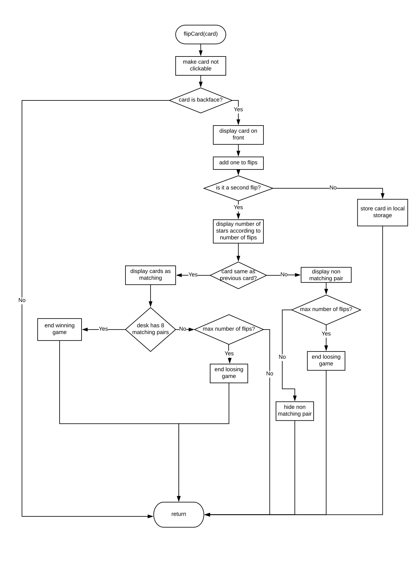

# DOCUMENTATION
## 1. Description ##
This is the documentation for fend project #3 (memory game). The application makes a website designed to play to memory game.  
Rules of the game are very simple. The player has a deck of 16 cazrds put face down. Each card show a picture and they are 8 pairs of pictures. The aim of the game is to find all pairs in a limited number of moves (16). flipping 2 cards counts as 1 move.  
If the 2 flipped cards match they stay face up, if not they are flipped back again.  
The player wins when all cards are face up.
## 2. Design ##
The game is full responsive and can be played on moblie phones, tablets and desktops.
The choice has been made of 2 differant layout fitting the best for different orientation of the screen.

 

!

## 3. Features of this realisation ##
This realisation adds a few features compared to a basic realisation.  
__Start over__: Player can restar the game at any moment. In this case cards are flushed and every thing restart.  
__Moves__: a counter display the number of moves.  
__Timer__: a timer is started and display the time ellapsed since the beginning at the game.  
__Stars__: the score pannel display 3 stars at the beginning, then 2 after 12 moves, 2 after 8 moves, 1 after 16 moves and 0 at 24 moves and the game ends.  
__Rules__: the player can display a modal popup at any time showing the rules of the game.  
__hint__: when the player press the `esc` key one hidden card is flipped front face for a short delay. The play has 3 hints per game.  
__Animations__: During the game some animations are displayed for compatible browsers according the status of the move, matching or not matching.
## 4. Realisation ##
The project is realised whith one html page using css to setup the layout and JavaScript for the logic of the game.
The directory tree for files is as follow:

### 4.1 DOM's Structure ###

### 4.2 Algorythms used ###
#### 4.2.1  Main algorythm ####

#### 4.2.2 Flip card algorytm ####
This function called at a click event on a card is the heart of the game and manage the most important part of the game's logic.

### 4.3 Code ###
#### 4.3.1 Global constants and variables #####
Constants:
* play : holds the start button element
* maxFlips : maximum number of cards flips before game ends (i.e. moves*2)
* oneStar = number of flips when score goes to 1 star
* twoStars = number of flips when score goes to 2 stars

Variables:
* timer: number of seconds ellapsed while playing a game
* firstCard: variable used to store the element of the first card
* timerIntervalId: store the value returned by setInterval in order to be able to stop the timer.
* flips: number of cards flipped since the beginning of a game, a move=2 flips
* hintLeft: number of hints left during a game
* deck: collection of elements containing the deck. It's filled with pairs of html elements representing the value of the eight pairs of different cards.
* cards:collection of elements containing the complete html elements of the cards of the deck.
* timerScore: element displaying the timer.
* moveScore: element diplaying the number of moves.
* stars: element dispalying the number of stars.

Local storage:
The local storage is used to store the state of the game every second. The structure of the dahe is:
- localStorage.saved: 'true' if a game is saved, 'false' otherwise.
- localStorage.timer: string whiche is diplayed by timer element.
- localStorage.flips: flips variable conveted to string.
- localStorage.hintLeft: hintLeft variable convetedto sting.
- localStorage.deck: desk variable conveted to string using JSON.stringify.
- localStorage.firstCard: value of this index of firstCard in cards converted to string.

#### 4.3.2 Functions ####
#### ___Functions used as event listener:___ ####

  - __changeTimer():__ called every second when game is started Add one second to timer, format and Display ellaped time in score pannel.

  - __flipCard(card):__
      Action: flip the clicked card and do all need checks accordind to the game logic (see comments before the function for details).  
      _Parameter:_ card --> the DOM element clicked returned by the event.

  - __notMatchingCards(cardOne,cardTwo):__
      called to flip on the back side a non matching pair of cards. A time
      count is needed in order to let the animation goes to its end.  
      _Parameter:_
      * cardOne --> DOM element of the first card needing animation.  
      * cardTwo --> DOM element of the second card needing animation.

  - __function hideHint(putItBack):__
      Action: Put a card back face up after a hint. It's called by a timer in order to give some delay to the player to see the hint. If hint are still allowed, the proper event is added back.  
      _Parameter:_ putItBack --> the DOM element of the card to be put back face up.

  - __function hint(e):__
      Action: fip a random back face card to front for 1 to 2 seconds to give a hint to player. On exit set a time out to hide the hint. Decrease the number of allowed hint.  
      _Parameter:_ e:--> keyboard event wich called it, used to retrieve the stroked key and display the hint or not.

  - __startGame(restore):__
      event listener for clicks on the play button in main window or in modal  popup at the end of the game. It initialize everything to have a clean    shuffled deck and then set up the logic of the game:
      - Event on click on cards.
      - Interval for the timer.
      - Event to pause the game on click of the timer.
      - Event to show a hint.

  _Parameter:_ restore --> variable telling if a game needs to be restored or not according if the function was called from the game or a page of the game load.

  #### ___Functions to be called for repetitive actions of the logic of the game:___ ####

  - __endGame(win):__
      Action: modifify the DOM to display the end of game modal popup. Stop the timer and put all cards front side up.  
      _Parameter:_ win --> boolean to set the proper popup in accordance of the state
      game.

  - __makeCardsflippable(allowed):__
      Action: add or remove an event on all DOM's element of the class .card  according to the parameter.  
      _Parameter:_ allowed --> boolean, true the cards are clickable, false they aren't.
  - __restoreGame():__
      Restore the game in the local storage. Local storage stores only strings and data store are adapted to that. The structure of data store is:
      - saved: 'true' if a game is saved, 'false' otherwise.
      - timer: string whiche is diplayed by timer element.
      - flips: flips variable conveted to string.
      - hintLeft: hintLeft variable convetedto sting.
      - deck: desk variable conveted to string using JSON.stringify.
      - firstCard: value of this index of firstCard in cards converted to string.

  - __shuffleCards():__
      generic function to shuffle any object which can be enumarated.
      algorythm was found on the net on several website.

  - __storeGame():__
      Store the game in the local storage. See restoreGame() for a description of the data.
