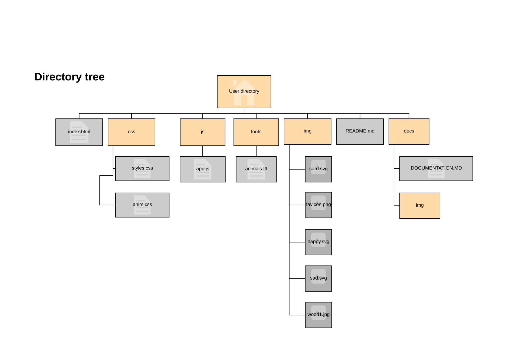

# DOCUMENTATION
## 1. Description ##
This is the documentation for fend project #3 (memory game). The application makes a website designed to play to memory game.  
Rules of the game are very simple. The player has a deck of 16 cazrds put face down. Each card show a picture and they are 8 pairs of pictures. The aim of the game is to find all pairs in a limited number of moves (16). flipping 2 cards counts as 1 move.  
If the 2 flipped cards match they stay face up, if not they are flipped back again.  
The player wins when all cards are face up.
## 2. Design ##
The game is full responsive and can be played on moblie phones, tablets and desktops.
The choice has been made of 2 differant layout fitting the best for different orientation of the screen.

## 3. Features of this realisation ##
This realisation adds a few features compared to a basic realisation.  
__Start over__: Player can restar the game at any moment. In this case cards are flushed and every thing restart.  
__Moves__: a counter display the number of moves.  
__Timer__: a timer is started and display the time ellapsed since the beginning at the game.  
__Stars__: the score pannel display 3 stars at the beginning, then 2 after 12 moves, 2 after 8 moves, 1 after 16 moves and 0 at 24 moves and the game ends.  
__Rules__: the player can display a modal popup at any time showing the rules of the game.  
__hint__: when the player press the `esc` key one hidden card is flipped front face for a short delay. The play has 3 hints per game.  
__Animations__: During the game some animations are displayed for compatible browsers according the status of the move, matching or not matching.
## 4. Realisation ##
The project is realised whith one html page using css to setup the layout and JavaScript for the logic of the game.
The directory tree for files is as follow:

## 5. Algorythms used ##

